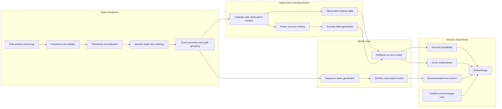
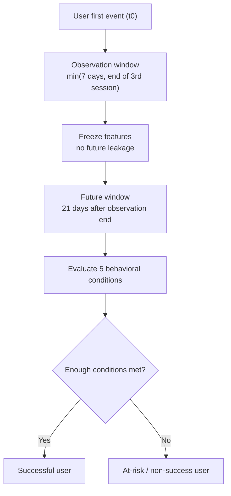
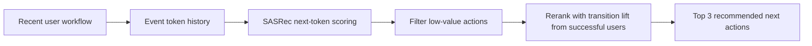
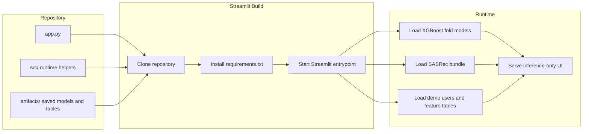

# Zerve Success and Churn Intelligence App

## Description

This repository contains a deployment-ready Streamlit application that predicts which Zerve users are likely to become successful users, identifies early churn risk, explains the strongest behavioral drivers behind the prediction, and recommends the next best actions based on successful workflow patterns.

The repository is intentionally packaged for inference and deployment only. Training has already been completed offline, and the required model files and runtime artifacts are stored in `artifacts/` so the app can be deployed without rerunning notebook pipelines or cloud jobs.

## Executive Summary

Zerve users generate rich event streams across notebooks, canvases, tools, collaboration flows, and deployment actions. The problem solved here is:

**How can we use a user’s earliest product behavior to estimate future success, surface churn risk early, and recommend the next actions that are most associated with successful outcomes?**

This project answers that with a hybrid modeling system:

- A **user-level XGBoost classifier** predicts future success probability from observation-window features such as session return behavior, action diversity, code-related usage, workflow transitions, and value signals.
- A **SASRec sequence recommender** predicts likely next best actions from the user’s recent workflow history.
- The app combines those outputs into a practical decision layer:
  - success probability
  - relative risk band / percentile
  - top positive and negative drivers
  - recent workflow timeline
  - next-step recommendations
  - closest successful archetype

Saved holdout performance from the precomputed artifact bundle:

- ROC-AUC: `0.8664`
- PR-AUC: `0.7072`
- Recall@Top 10%: `0.2887`
- Lift@Top 10%: `2.9216`

## Problem Statement

The core business problem is early lifecycle intelligence:

- Identify users who show signs of strong activation and durable product value.
- Detect users whose early activity looks shallow, noisy, or inconsistent with successful patterns.
- Turn behavioral telemetry into operational guidance instead of just retrospective analytics.

In plain terms, this app helps answer:

1. Which users are likely to succeed?
2. Which users are at higher churn risk?
3. What actions are driving that assessment?
4. What should the user do next to improve the odds of success?

## End-to-End Modeling Flow



## Labeling Logic

The supervised target is not a trivial “did the user return once” label. Instead, future success is defined using a multi-condition behavioral rule after the observation window ends.

Success is based on a future window that checks signals such as:

- repeated sessions
- repeated active days
- productive actions
- value signals like credits usage
- workflow complexity and action diversity

This makes the target more product-meaningful than simple retention alone.



## Feature and Recommendation Strategy

### Success model

The XGBoost model uses observation-only features derived from early user behavior, including:

- number of sessions
- active days
- session depth and duration
- event diversity
- tool usage
- cross-surface transitions
- code-related activity
- deployment/value events
- device and surface summary features

### Sequence model

The SASRec recommender uses tokenized event histories to predict the next most likely meaningful actions. Recommendations are then reranked using transition lift learned from successful users and filtered to remove low-value navigation-like actions.



## What The App Shows

For each demo user, the deployed app presents:

- **Success Probability**: estimated probability of future success
- **Percentile / Risk Band**: where the user sits relative to others
- **Positive Drivers**: features pushing the score upward
- **Negative Drivers**: features pushing the score downward
- **Workflow Timeline**: latest saved observed interactions
- **Top 3 Next Actions**: recommended next steps based on sequence modeling
- **Closest Successful Archetype**: nearest successful user cluster

## Repository Structure

```text
.
├── app.py
├── requirements.txt
├── src/
│   ├── __init__.py
│   ├── inference.py
│   ├── io_utils.py
│   ├── sequence_data.py
│   └── train_sasrec.py
└── artifacts/
    ├── manifest.json
    ├── feature_columns.json
    ├── xgb_fold_*.json
    ├── sasrec_model.pt
    ├── token_to_id.json
    ├── id_to_token.json
    ├── demo_users.parquet
    ├── demo_sessions.parquet
    ├── transition_lift.parquet
    ├── archetypes.parquet
    └── intermediate/user_feature_table.parquet
```

## Deployment Flow



## Run Locally

```bash
pip install -r requirements.txt
streamlit run app.py
```

No training step is required for local execution.

## Why The Deployment Is Fast

This repository is optimized for deployment, not experimentation:

- model training is already complete
- no notebook execution is required to run the app
- no SageMaker or external training infrastructure is needed at inference time
- all runtime artifacts are already bundled in the repository

That means Streamlit can build the environment, load the saved bundle, and serve predictions directly.
